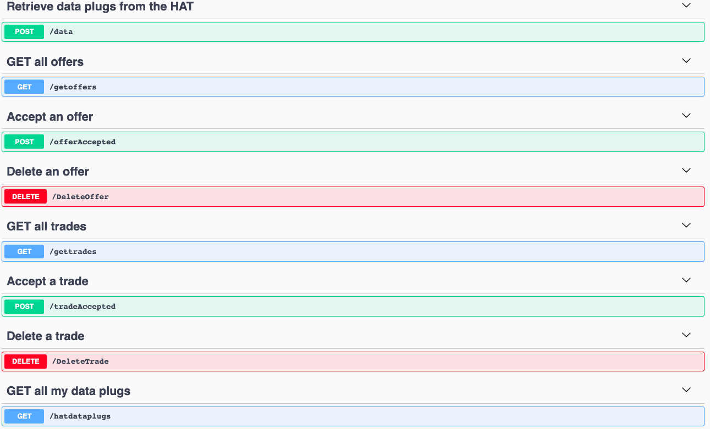

# DHT_DataProvider
This service processes data purchase requests.

A full Restful CRUD API for managing dataproviders written in Node.js, Express and MongoDB.


## Steps to setup the service

**Install dependencies**

```bash
npm install --save
```
**Run api on the development environment**

```bash
npm start
```

**Run the service using make**

```bash
make run-all
```

## Run the dataprovider API
**You can browse the api at:** <http://localhost:4020>

Here are the following API endpoints:



## Run unit tests

```bash
npm test
```