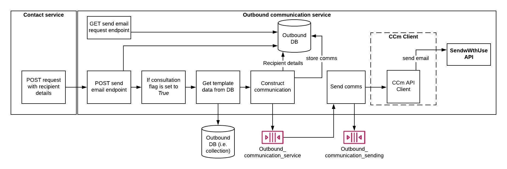

# DHT_DataProvider
This service processes data purchase requests.

A full Restful CRUD API for managing dataproviders written in Node.js, Express and MongoDB.



## Steps to setup the service

**Install dependencies**

```bash
npm install
```
**Run Server**

```bash
node server.js
```

**Run the service using make**

```bash
make run-all
```

## Run the dataprovider API
**You can browse the api at:** <http://localhost:5000>

Here are the following API endpoints:

1.	Create a new dataprovider: **POST** http://localhost:5000/dataproviders
2.	Retrieve all dataproviders: **GET** http://localhost:5000/dataproviders
3.	Retrieve a single dataprovider with dataproviderId: **GET** http://localhost:5000/dataproviders/{dataproviderId}
4. Update a dataprovider with dataproviderId: **PUT** http://localhost:5000/dataproviders/{dataproviderId}
5. Delete a dataprovider with dataproviderId: **DELETE** http://localhost:5000/dataproviders/{dataproviderId}

## Run unit tests